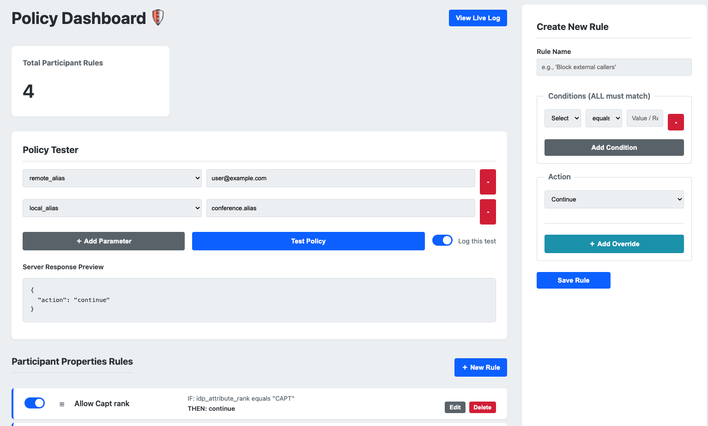

# Pexip Policy Server with Web UI (Rule Builder & Exporter)

This project is a powerful, web-based external policy server for Pexip Infinity, built with Flask. It allows administrators to create and manage dynamic, rule-based policies for call control through an intuitive dashboard interface, removing the need to write custom code for each policy change.

A key feature is its ability to **export** the rules created in the UI into the native **Pexip Local Policy** format, which can be directly copied into your Pexip Infinity deployment.



## Features

* **Web Dashboard:** A clean, modern dashboard to create, view, edit, and delete policy rules.
* **Native Policy Exporter:** Automatically generate a Pexip-compliant Local Participant Policy. The exporter correctly uses `pex_regex_search` and `` variables for optimal performance.
* **Docker Support:** Includes `Dockerfile` and `docker-compose.yml` for easy, containerized deployment.
* **Dual Policy Support:** Handles both **Service Configuration** and **Participant Properties** policy requests.
* **Dynamic Rule Engine:**
    * Create rules with multiple conditions.
    * Use a variety of operators, including `equals`, `contains`, `does not contain`, and `regex_match`.
    * **Drag-and-Drop Prioritization** to control the evaluation order.
* **Rule Management:**
    * **Enable/Disable** rules with a simple toggle switch without deleting them.
    * Grouped view to easily distinguish between service and participant rules.
* **Dynamic Overrides:** For `continue` actions, dynamically override Pexip's default settings on a per-call basis for both service and participant properties.
* **In-App Policy Tester:** A UI panel to simulate participant policy requests and preview the server's JSON response without making a live call.
* **Live Log Viewer:** A real-time log stream, accessible from the dashboard, for advanced troubleshooting and monitoring of policy requests and responses.
* **Database Migrations:** Uses Flask-Migrate (Alembic) to safely manage database schema changes without losing data.
* **CLI Commands:** Includes commands for easy database setup, seeding with default rules, and complete resets for development.

---

## Getting Started

You can run this application using Docker (recommended) or as a standard local Python application.

### Option 1: Running with Docker (Recommended) 🐳

This is the easiest and most reliable way to run the server.

#### Prerequisites
* [Docker](https://docs.docker.com/get-docker/)
* [Docker Compose](https://docs.docker.com/compose/install/)

#### Instructions

1.  **Build and Start the Container**
    From the root of the project directory, run the following command. This will build the Docker image based on the `Dockerfile` and start the container in the background.

    ```bash
    docker compose up --build -d
    ```

2.  **Set Up the Database (First-Time Only)**
    The first time you start the container, you need to run the database migrations and seeding commands *inside* the running container.

    ```bash
    # Apply migrations to create the database tables
    docker compose exec policy-server flask db upgrade

    # (Optional) Seed the database with example rules
    docker compose exec policy-server flask seed-db
    ```

Your application is now running! You can access the admin dashboard at `http://localhost:5001/admin`.

#### Managing the Container
* **To view live logs:**
    ```bash
    docker compose logs -f policy-server
    ```
* **To stop the container:**
    ```bash
    docker compose down
    ```

---

### Option 2: Running Locally (Without Docker) 🐍

Follow these steps to run the application directly on your machine.

#### Prerequisites
* Python 3.8+
* `pip` for package installation

#### Setup Instructions

1.  **Set Up the Environment**
    First, clone the repository and create a Python virtual environment.
    ```bash
    # Clone the repository
    git clone <your-repo-url>
    cd <your-repo-folder>

    # Create and activate a virtual environment
    python -m venv venv
    source venv/bin/activate  # On Windows, use: venv\Scripts\activate
    ```

2.  **Install Dependencies**
    Install the required Python packages from the `requirements.txt` file.
    ```bash
    pip install -r requirements.txt
    ```

3.  **Set Up the Database**
    This application uses Flask-Migrate to manage the database.
    ```bash
    # Set the FLASK_APP environment variable
    export FLASK_APP=app.py  # On Windows, use: set FLASK_APP=app.py

    # 1. Initialize the migration environment (only run this once per project)
    flask db init

    # 2. Generate the initial migration script from your models
    flask db migrate -m "Initial migration"

    # 3. Apply the migration to create the database file
    flask db upgrade
    ```

4.  **(Optional) Seed the Database**
    You can populate the database with a few default example rules to get started.
    ```bash
    flask seed-db
    ```

#### Running the Server
Start the Flask development server.
```bash
flask run --host=0.0.0.0 --port=5001
```
The server will now be running. Access the admin dashboard at `http://<your_server_ip>:5001/admin`.

---

## Pexip Infinity Configuration

In your Pexip Infinity Administrator interface, configure an **External Policy Server** (`Platform` > `External Policy Servers`) and point it to this server's endpoints:

* **Participant Properties:** `http://<your_server_ip>:5001`