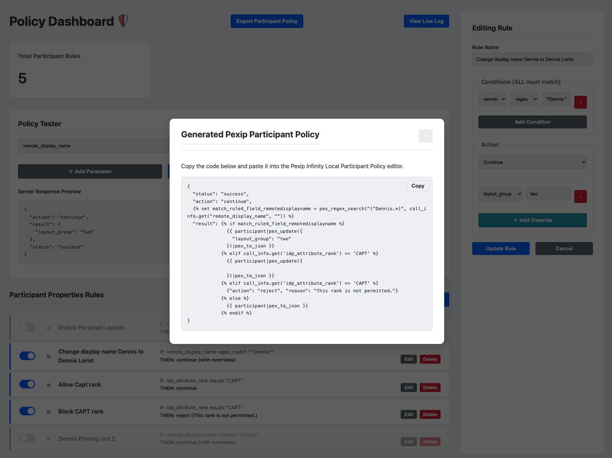

# Pexip Policy Server with Web UI (Rule Builder & Exporter)

This project is a powerful, web-based external policy server for Pexip Infinity, built with Flask. It allows administrators to create and manage dynamic, rule-based policies for call control through an intuitive dashboard interface, removing the need to write custom code for each policy change.

A key feature is its ability to **export** the rules created in the UI into the native **Pexip Local Policy** format, which can be directly copied into your Pexip Infinity deployment.



## Features

* **Web Dashboard:** A clean, modern dashboard to create, view, edit, and delete policy rules.
* **Native Policy Exporter:** Automatically generate a Pexip-compliant Local Participant Policy. The exporter correctly uses `pex_regex_search` and `` variables for optimal performance.
* **Dual Policy Support:** Handles both **Service Configuration** and **Participant Properties** policy requests.
* **Dynamic Rule Engine:**
    * Create rules with multiple conditions.
    * Use a variety of operators, including `equals`, `contains`, `does not contain`, and `regex_match`.
    * **Drag-and-Drop Prioritization** to control the evaluation order.
* **Rule Management:**
    * **Enable/Disable** rules with a simple toggle switch without deleting them.
    * Grouped view to easily distinguish between service and participant rules.
* **Dynamic Overrides:** For `continue` actions, dynamically override Pexip's default settings on a per-call basis for both service and participant properties.
* **In-App Policy Tester:** A UI panel to simulate participant policy requests and preview the server's JSON response without making a live call.
* **Live Log Viewer:** A real-time log stream, accessible from the dashboard, for advanced troubleshooting and monitoring of policy requests and responses.
* **Database Migrations:** Uses Flask-Migrate (Alembic) to safely manage database schema changes without losing data.
* **CLI Commands:** Includes commands for easy database setup, seeding with default rules, and complete resets for development.

---

## Requirements

* Python 3.8+
* `pip` for package installation

---

## Installation & Setup

Follow these steps to get the application running locally.

### 1. Set Up the Environment

First, clone the repository and create a Python virtual environment.

```bash
# Clone the repository (if you haven't already)
git clone <your-repo-url>
cd <your-repo-folder>

# Create and activate a virtual environment
python -m venv venv
source venv/bin/activate  # On Windows, use: venv\Scripts\activate
```

### 2. Install Dependencies

Install the required Python packages. For easy deployment, you can save your dependencies to a file: `pip freeze > requirements.txt` and then install from it using `pip install -r requirements.txt`.

```bash
pip install Flask Flask-SQLAlchemy Flask-Migrate
```

### 3. Set Up the Database

This application uses Flask-Migrate to manage the database.

```bash
# Set the FLASK_APP environment variable
export FLASK_APP=app.py  # On Windows, use: set FLASK_APP=app.py

# 1. Initialize the migration environment (only run this once per project)
flask db init

# 2. Generate the initial migration script from your models
flask db migrate -m "Initial migration"

# 3. Apply the migration to create the database file
flask db upgrade
```

### 4. (Optional) Seed the Database

You can populate the database with a few default example rules to get started.

```bash
flask seed-db
```

---

## Usage

### 1. Running the Server

Start the Flask development server. The `--host=0.0.0.0` flag is crucial to make the server accessible to other machines on your network, like your Pexip Conferencing Nodes.

```bash
flask run --debug --host=0.0.0.0 --port=5001
```

The server will be running on port `5001`.

### 2. Accessing the Admin Dashboard

Open your web browser and navigate to the admin interface:

`http://<your_server_ip>:5001/admin`

Here, you can manage all your policy rules.

### 3. Using the Policy Exporter

1.  Create and enable the rules you need for your policy.
2.  On the main dashboard, click the **Export Participant Policy** button.
3.  A modal window will appear with the generated Pexip Local Policy.
4.  Click the **Copy** button and paste the code directly into the Pexip Infinity Administrator interface at `Policy` > `Local Participant Policy`.

### 4. Configuring Pexip Infinity

In your Pexip Infinity Administrator interface, configure an **External Policy Server** (`Platform` > `External Policy Servers`) and point it to this server's endpoints:

* **Participant Properties:** `http://<your_server_ip>:5001/policy/v1/participant/properties`

---

## Troubleshooting & Monitoring

### In-App Policy Tester

The dashboard includes a **Policy Tester** panel that allows you to simulate a participant policy request and see a live preview of the server's response.

1.  Navigate to the admin dashboard.
2.  In the **Policy Tester** panel, enter test values for the parameters you want to simulate (e.g., `remote_alias`, `idp_attribute_rank`).
3.  Click the **"Test Policy"** button.
4.  The **Server Response Preview** box will update to show the exact JSON response the server would send to Pexip for that request.

### Live Log Viewer

For real-time monitoring, the application provides a live log stream.

1.  From the main dashboard, click the **"View Live Log"** button. This will open the log viewer in a new tab.
2.  The viewer will stream all incoming requests and the corresponding policy responses as they happen. This is the best way to see the full request URL from Pexip and troubleshoot why a specific rule did or did not match.
3.  The server also writes these logs to a rotating file named `policy_server.log` in the project's root directory.

---

## Database Management Commands

* **Reset the Database:** To completely wipe and re-seed the database during development, use the custom `reset-db` command.

    ```bash
    flask reset-db
    ```

* **Making Schema Changes:** If you modify the models in `app.py` (e.g., add a new column), follow this two-step process to safely update the database:

    ```bash
    # 1. Generate a new migration script
    flask db migrate -m "A short message about your changes"

    # 2. Apply the changes to the database
    flask db upgrade
    ```
